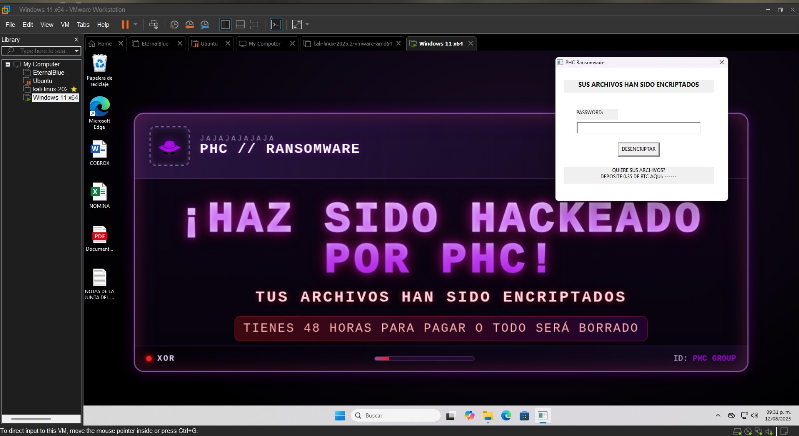
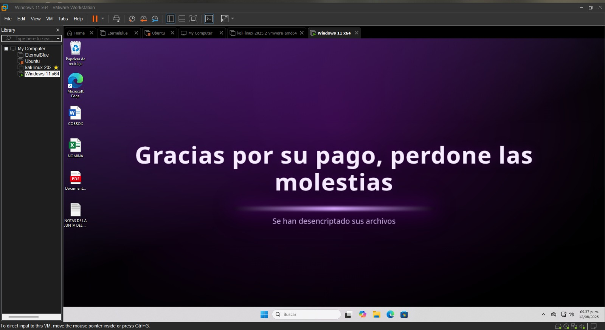

# 🔐 XOR-Encryptor — Demo educativo de Ransomware

Implementación didáctica de un algoritmo simple de cifrado XOR pensada exclusivamente para aprendizaje y pruebas en entornos aislados. Incluye una utilidad en C++ (demo), una herramienta en Python para convertir PNG a header C, un diagrama de funcionamiento y un PDF con la explicación del laboratorio.

## ⚙️ Funcionamiento Basico

Al ejecutarse lee los archivos del Escritorio, genera una clave aleatoria de 32 bytes y aplica padding PKCS7; luego cifra cada archivo (operación XOR con la clave), guarda la clave y los datos en formato HEX y cambia el fondo de pantalla para mostrar un bloqueo. Después muestra una GUI que pide una contraseña; si el usuario ingresa la contraseña correcta (en el diagrama es 1234), convierte la clave HEX a bytes, descifra los archivos (XOR inverso), elimina el padding y restaura los archivos y el wallpaper mostrando un mensaje de éxito; si la contraseña es incorrecta, muestra un error y mantiene el bloqueo.

<div align="center">

### Diagrama


</div>

## 🛠️ Como compilar

### 🪟 Compilación en Windows

Usar MinGW-w64 o MSYS2

```bash
g++ -o PHCACADEMICO.exe phc_main.cpp -mwindows -lgdi32 -luser32 -lcomctl32 -static-libgcc -static-libstdc++ -O2
```
### 🐧 Compilación en Ubuntu/Linux

```bash
x86_64-w64-mingw32-g++ -o PHCACADEMICO.exe phc_main.cpp -mwindows -lgdi32 -luser32 -lcomctl32 -static-libgcc -static-libstdc++ -O2
```

## ⚠️ Descargo de responsabilidad

El ejemplo de Ransomware tienen fines exclusivamente académicos y de aprendizaje en el ámbito de la ciberseguridad. No se promueve ni se autoriza el uso de este tipo de código o procedimientos con fines maliciosos o que vulneren la integridad de sistemas o datos reales.
## 📸 Capturas de pantalla

<div align="center">

### Wallpaper Encriptado


### Prueba de Encriptado


### Wallpaper Recuperado


</div>

## 🎬 Demo
Soon

